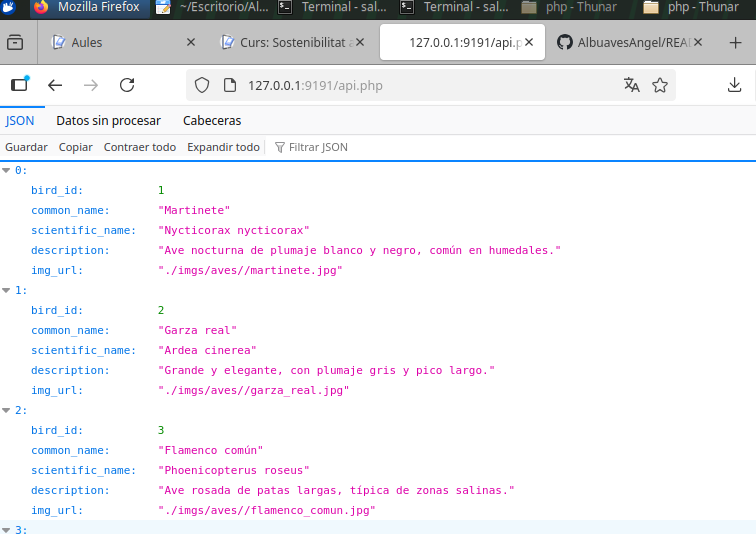
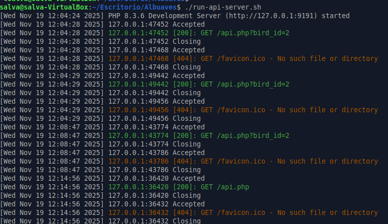
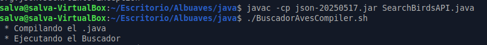

#### Salva Lozano Díaz
# Albuaves

## Capturas de pantalla

Captura de pantalla del funcionamiento web de la API, la nueva versión que está en ingles.

	

Captura de pantalla del servidor PHP en marcha desde la terminal.

	

Y la última captura de pantalla que es la ejecución de archivo java y bash.

	

## Tecnologías utilizadas

Este proyecto utiliza varias tecnologías

1. Sqlite

     Su uso en este proyecto ha sido la creacion y consultas de la base de datos.

    Pagina web: https://sqlite.org/
    Licencia: Dominio Público

3. Java

   Su uso en este proyecto es actuar como cliente en la base de datos y conectarse a ella.

   Pagina web: https://www.java.com/es/
   Licencia: OpenJDK — Licencia: GPL v2 + Classpath Exception

4. PhP

   Su uso es este proyecto es encargarse de las peticiones web y de usar correctamente el          filtro por bird_id.

   Pagina web: https://www.php.net/
   Licencia: PHP License 3.01

## Tutorial para la puesta en marcha

En el repositorio estarán adjuntados todos los archivos necesarios para poner en marcha el servidor

1. Lo primero de todo será instalar todo aquello necesario para un correcto funcionamiento:

   sudo apt install sqlite3
   sudo apt install javac
   sudo apt install php

2. Poner en marcha el servidor, para ello ejecutar el archivo run-api-server.sh

     chmod -x run-api-server.sh
   
   ./run-api-server.sh

3. Ahora tendremos que poner en marcha los archivos java y otro bash, los cuales se encuentran en la carpeta java, uno de ellos necesita el uso de una libreria la cual ya se encuentra en el repositorio adjuntado, habrá que indicar su uso en la ejecución.

      javac -cp json-20250517.jar SearchBirdsAPI.java
   
   javac albuaves_api_rest.java
   
   chmod -x BuscadorAvesCompiler
   
   ./BuscadorAvesCompiler

5. Realizados todos los pasos anteriores accediendo a la dirección http://127.0.0.1:9191/api.php ya estará disponible el servidor, si desea buscar por id tendra que añadir a la ruta http://127.0.0.1:9191/api.php?bird_id=(numero). 

   

   
